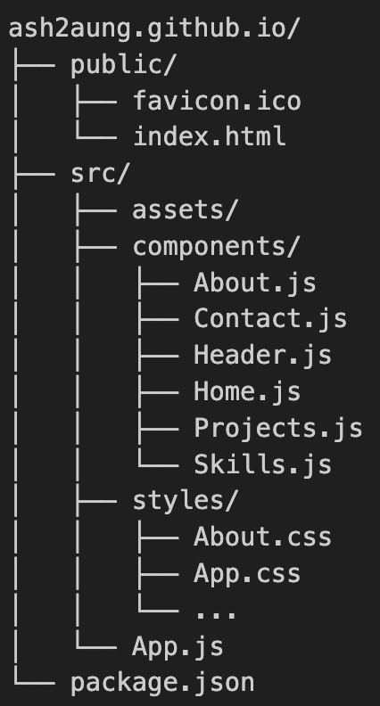

# Ash's Portfolio Website

A personal portfolio website built with React and modern CSS features to showcase my projects, skills, and experience as a Software Systems student at Simon Fraser University.

## 🌟 Live Demo
Visit the live website: [ash2aung.github.io](https://ash2aung.github.io)


## 🎯 Features
- Home page with an introduction
- Project section with live demos and GitHub links
- Skills visualization with progress bars
- Detailed about section with personal background
- Contact information with social links
- Downloadable resume feature
- Responsive design that works on desktop and mobile
- Interactive navigation with smooth transitions

## 🛠 Technologies Used
- **React**: For building the user interface
- **React Router**: For handling navigation
- **CSS3**: For styling and animations
- **Lucide React**: For icons
- **GitHub Pages**: For deployment

## 💻 Installation
1. Clone the repository:
   ```sh
   git clone https://github.com/ash2aung/ash2aung.github.io.git
   ```
2. Navigate to the project folder:
   ```sh
   cd ash2aung.github.io
   ```
3. Install dependencies:
   ```sh
   npm install
   ```
4. Start the development server:
   ```sh
   npm start
   ```

## 🚀 Deployment
The site is deployed using GitHub Pages. To deploy new changes:
```sh
npm run deploy
```
## 📁 Project Structure


## 📜 License
This project is licensed under the MIT License - see the [LICENSE file](./license) for details.

Why MIT License? I chose the MIT License because:
- It's simple and permissive
- Allows others to use my code freely for learning
- Promotes open-source collaboration
- Provides basic liability protection
- Widely recognized in the software community
- Compatible with other licenses


## 📞 Contact
For inquiries, reach out via:
- Email: ash2aung@example.com
- LinkedIn: [linkedin.com/in/ash2aung](https://linkedin.com/in/ash2aung)
- GitHub: [github.com/ash2aung](https://github.com/ash2aung)

